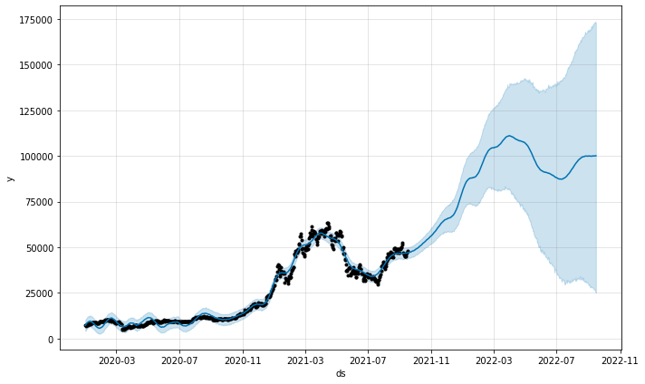
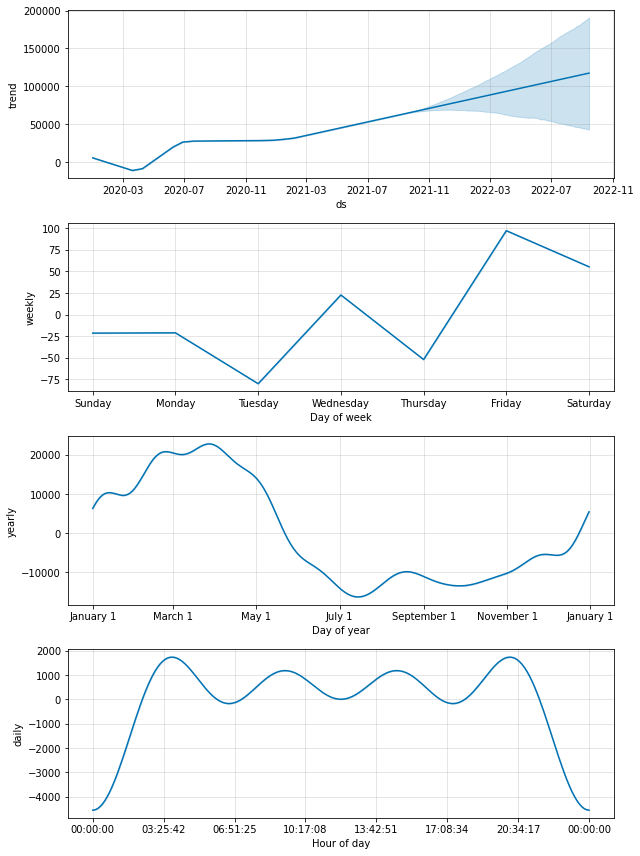

<h1>Bitcoin Price prediction</h1>
<ul>
    <li><a href="#1" style="text-decoration: none;">What is bitcoin?</a></li>
    <li><a href="#2" style="text-decoration: none;">Why we are working about?</a></li>
    <li><a href="#3" style="text-decoration: none;">What data we used?</a></li>
    <li>
        <ul>
            <li><a href="#4" style="text-decoration: none;">Load Python libray and Data</a></li>
            <li><a href="#5" style="text-decoration: none;">Preprocess</a></li>
            <li><a href="#6" style="text-decoration: none;">Prediction</a></li>
            <li><a href="#7" style="text-decoration: none;">Visualization</a></li>
        </ul>
    </li>
</ul>
<h3 id='1'>What is bitcoin?</h3>
<p>Bitcoin is a currency, which is a decentralized digital currency. There haven't any central bank or specific adminstration for this. The tranaction of bitcoin occure by user to user. The code of this currency are BTC and XBT</p>

<h3 id='2'>Why we are predicting?</h3>
<p>At present, Bitcoin is taking more attection to the people due to the price surge. It has consider as a finantial asset and even it is traded through many cryptocurrency exchanges like a stock market. Since it is up rising market, many investors are investing here, also hiring analyst to get useful petter for there company. Even also many researchers are working on it. As a data analyst I am also trying to predict Bitcoin price using propet model.</p>

<h3 id='3'>What data we used?</h3>
<p>Fot doing forcast, we have used <a href="https://finance.yahoo.com/quote/BTC-USD/history?p=BTC-USD">Yahoo Finance</a>. I have taken data from Jan 01, 2020 to Sep 16, 2021, which was daily basis frequency. To know more about download strategy <a href="https://www.macroption.com/yahoo-finance-download-historical-data/">Click Here</a></p>

<h3 id='4'>Load Python libray and Data</h3>
<p>After download the data. It time to load python libray.</p>


```python
import pandas as pd
from prophet import Prophet
```

<p><b>Load Data</b></p>


```python
df = pd.read_csv('BTC-USD.csv')
```

<h3 id='5'>Preprocess</h3>
<p>The input to Prophet is always a dataframe with two columns: ds and y. The ds (datestamp) column should be of a format expected by Pandas, ideally YYYY-MM-DD for a date or YYYY-MM-DD HH:MM:SS for a timestamp. The y column must be numeric, and represents the measurement we wish to forecast. So I have to do some simple celan up to removing some type of unuseful columns</p>


```python
df.head()
```


<div>
<style scoped>
    .dataframe tbody tr th:only-of-type {
        vertical-align: middle;
    }

    .dataframe tbody tr th {
        vertical-align: top;
    }

    .dataframe thead th {
        text-align: right;
    }
</style>
<table border="1" class="dataframe">
  <thead>
    <tr style="text-align: right;">
      <th></th>
      <th>Date</th>
      <th>Open</th>
      <th>High</th>
      <th>Low</th>
      <th>Close</th>
      <th>Adj Close</th>
      <th>Volume</th>
    </tr>
  </thead>
  <tbody>
    <tr>
      <th>0</th>
      <td>2020-01-01</td>
      <td>7194.892090</td>
      <td>7254.330566</td>
      <td>7174.944336</td>
      <td>7200.174316</td>
      <td>7200.174316</td>
      <td>1.856566e+10</td>
    </tr>
    <tr>
      <th>1</th>
      <td>2020-01-02</td>
      <td>7202.551270</td>
      <td>7212.155273</td>
      <td>6935.270020</td>
      <td>6985.470215</td>
      <td>6985.470215</td>
      <td>2.080208e+10</td>
    </tr>
    <tr>
      <th>2</th>
      <td>2020-01-03</td>
      <td>6984.428711</td>
      <td>7413.715332</td>
      <td>6914.996094</td>
      <td>7344.884277</td>
      <td>7344.884277</td>
      <td>2.811148e+10</td>
    </tr>
    <tr>
      <th>3</th>
      <td>2020-01-04</td>
      <td>7345.375488</td>
      <td>7427.385742</td>
      <td>7309.514160</td>
      <td>7410.656738</td>
      <td>7410.656738</td>
      <td>1.844427e+10</td>
    </tr>
    <tr>
      <th>4</th>
      <td>2020-01-05</td>
      <td>7410.451660</td>
      <td>7544.497070</td>
      <td>7400.535645</td>
      <td>7411.317383</td>
      <td>7411.317383</td>
      <td>1.972507e+10</td>
    </tr>
  </tbody>
</table>
</div>


```python
df.columns
```


    Index(['Date', 'Open', 'High', 'Low', 'Close', 'Adj Close', 'Volume'], dtype='object')


```python
df = df[["Date", "Close"]]
```


```python
df.columns = ["ds","y"]
df.columns
```


    Index(['ds', 'y'], dtype='object')


```python
df.head()
```


<div>
<style scoped>
    .dataframe tbody tr th:only-of-type {
        vertical-align: middle;
    }

    .dataframe tbody tr th {
        vertical-align: top;
    }

    .dataframe thead th {
        text-align: right;
    }
</style>
<table border="1" class="dataframe">
  <thead>
    <tr style="text-align: right;">
      <th></th>
      <th>ds</th>
      <th>y</th>
    </tr>
  </thead>
  <tbody>
    <tr>
      <th>0</th>
      <td>2020-01-01</td>
      <td>7200.174316</td>
    </tr>
    <tr>
      <th>1</th>
      <td>2020-01-02</td>
      <td>6985.470215</td>
    </tr>
    <tr>
      <th>2</th>
      <td>2020-01-03</td>
      <td>7344.884277</td>
    </tr>
    <tr>
      <th>3</th>
      <td>2020-01-04</td>
      <td>7410.656738</td>
    </tr>
    <tr>
      <th>4</th>
      <td>2020-01-05</td>
      <td>7411.317383</td>
    </tr>
  </tbody>
</table>
</div>


```python
df.shape
```


    (624, 2)


<h3 id='6'>Prediction</h3>


```python
fbPropt = Prophet(yearly_seasonality=True, daily_seasonality=True) #Define the model
fbPropt.fit(df)
```


    <prophet.forecaster.Prophet at 0x5b07016240>


<p>Now let's make a prediction of next 365 days uisng <b>make_future_dataframe()</b></p>


```python
prediction_dataframe = fbPropt.make_future_dataframe(periods=365)
prediction_dataframe.head()
```


<div>
<style scoped>
    .dataframe tbody tr th:only-of-type {
        vertical-align: middle;
    }

    .dataframe tbody tr th {
        vertical-align: top;
    }

    .dataframe thead th {
        text-align: right;
    }
</style>
<table border="1" class="dataframe">
  <thead>
    <tr style="text-align: right;">
      <th></th>
      <th>ds</th>
    </tr>
  </thead>
  <tbody>
    <tr>
      <th>0</th>
      <td>2020-01-01</td>
    </tr>
    <tr>
      <th>1</th>
      <td>2020-01-02</td>
    </tr>
    <tr>
      <th>2</th>
      <td>2020-01-03</td>
    </tr>
    <tr>
      <th>3</th>
      <td>2020-01-04</td>
    </tr>
    <tr>
      <th>4</th>
      <td>2020-01-05</td>
    </tr>
  </tbody>
</table>
</div>


```python
prediction_dataframe.shape
```


    (989, 1)


```python
prediction = fbPropt.predict(prediction_dataframe)
prediction[['ds', 'yhat', 'yhat_lower', 'yhat_upper']].tail()
```


<div>
<style scoped>
    .dataframe tbody tr th:only-of-type {
        vertical-align: middle;
    }

    .dataframe tbody tr th {
        vertical-align: top;
    }

    .dataframe thead th {
        text-align: right;
    }
</style>
<table border="1" class="dataframe">
  <thead>
    <tr style="text-align: right;">
      <th></th>
      <th>ds</th>
      <th>yhat</th>
      <th>yhat_lower</th>
      <th>yhat_upper</th>
    </tr>
  </thead>
  <tbody>
    <tr>
      <th>984</th>
      <td>2022-09-11</td>
      <td>99978.435154</td>
      <td>26999.296881</td>
      <td>172502.670943</td>
    </tr>
    <tr>
      <th>985</th>
      <td>2022-09-12</td>
      <td>100011.793115</td>
      <td>26819.459684</td>
      <td>173011.266805</td>
    </tr>
    <tr>
      <th>986</th>
      <td>2022-09-13</td>
      <td>99992.777479</td>
      <td>26744.364913</td>
      <td>172864.505094</td>
    </tr>
    <tr>
      <th>987</th>
      <td>2022-09-14</td>
      <td>100142.038293</td>
      <td>25882.821636</td>
      <td>173687.241777</td>
    </tr>
    <tr>
      <th>988</th>
      <td>2022-09-15</td>
      <td>100120.979413</td>
      <td>25084.470439</td>
      <td>172715.071498</td>
    </tr>
  </tbody>
</table>
</div>


<h3 id='7'>Visualization</h3>


```python
fbPropt.plot(prediction)
```





```python
fig2 = fbPropt.plot_components(prediction)
```





```python

```
