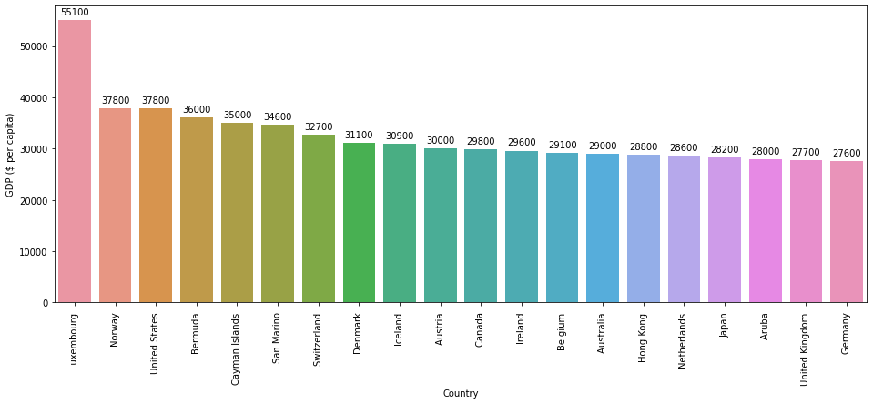
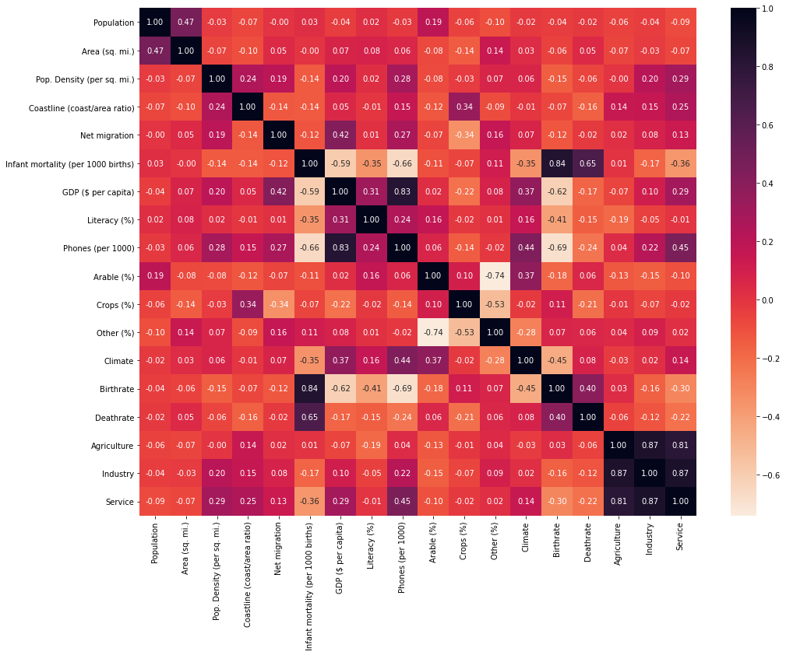
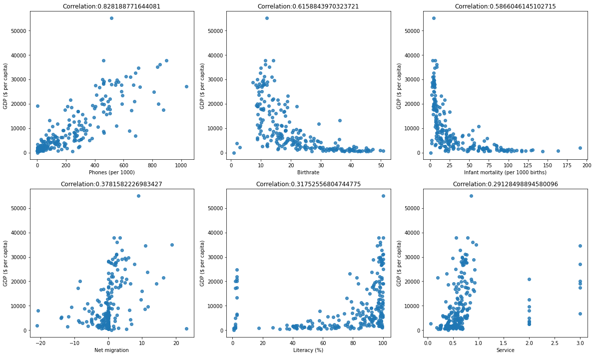
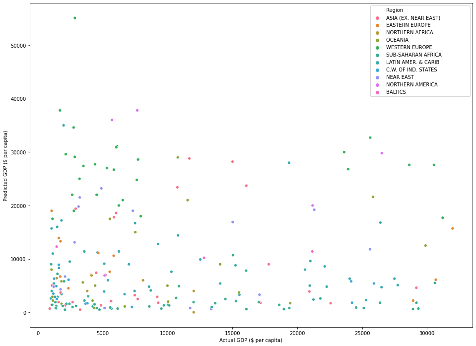
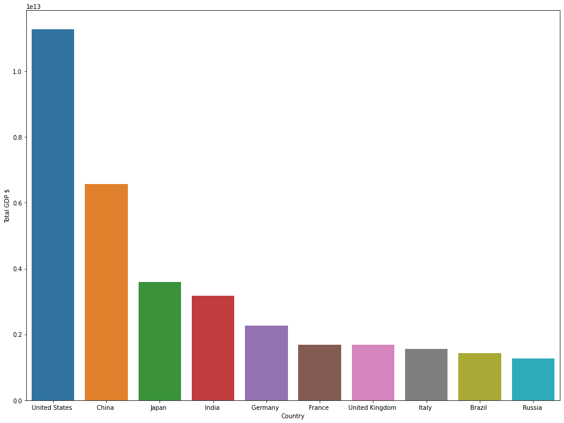

<h1>Factors effecting a country's GDP</h1>
<ul>
    <li><a href="#1" style="text-decoration: none;">Why we are working about?</a></li>
    <li><a href="#2" style="text-decoration: none;">What data we used?</a></li>
    <li>
        <ul>
            <li><a href="#3" style="text-decoration: none;">Load Python libray and Data</a></li>
            <li><a href="#4" style="text-decoration: none;">Preprocess and Anlysis</a></li>
            <li><a href="#5" style="text-decoration: none;">Prediction</a></li>
            <li><a href="#6" style="text-decoration: none;">Visualization</a></li>
        </ul>
    </li>
</ul>

<h3 id='1'>Why we are predicting?</h3>
<p>GDP is important because it show you the country's health. Also it demonstrate the economical position. Even indicate the size of economy. Doing prediction a country's GDP can take step more easily.</p>

<h3 id='2'>What data is avaiable</h3>
<p>To analys the GDP, we have used <a href="https://www.kaggle.com/stieranka/predicting-gdp-world-countries/data">Kaggle Dataset</a>. This Data compiled from <a href="https://gsociology.icaap.org/dataupload.html">US Government</a></p>

<h3 id='3'>Load Python libray and Data</h3>
<p>After download the data. It time to load python libray.</p>


```python
import numpy as np
import pandas as pd
import matplotlib.pyplot as plt
import seaborn as sns
```


```python
data = pd.read_csv('countries of the world.csv', decimal=',')
data.shape
```


    (227, 20)


<h3 id='4'>Preprocess and Anlysis</h3>
<p>As we can see, we have 227 instance to fit model and predict. Also we have 20 columns. Our trget columns is <b>GDP ($ per capita)</b></p>


```python
data.columns
```


    Index(['Country', 'Region', 'Population', 'Area (sq. mi.)',
           'Pop. Density (per sq. mi.)', 'Coastline (coast/area ratio)',
           'Net migration', 'Infant mortality (per 1000 births)',
           'GDP ($ per capita)', 'Literacy (%)', 'Phones (per 1000)', 'Arable (%)',
           'Crops (%)', 'Other (%)', 'Climate', 'Birthrate', 'Deathrate',
           'Agriculture', 'Industry', 'Service'],
          dtype='object')


```python
data.head()
```


<div>
<style scoped>
    .dataframe tbody tr th:only-of-type {
        vertical-align: middle;
    }

    .dataframe tbody tr th {
        vertical-align: top;
    }

    .dataframe thead th {
        text-align: right;
    }
</style>
<table border="1" class="dataframe">
  <thead>
    <tr style="text-align: right;">
      <th></th>
      <th>Country</th>
      <th>Region</th>
      <th>Population</th>
      <th>Area (sq. mi.)</th>
      <th>Pop. Density (per sq. mi.)</th>
      <th>Coastline (coast/area ratio)</th>
      <th>Net migration</th>
      <th>Infant mortality (per 1000 births)</th>
      <th>GDP ($ per capita)</th>
      <th>Literacy (%)</th>
      <th>Phones (per 1000)</th>
      <th>Arable (%)</th>
      <th>Crops (%)</th>
      <th>Other (%)</th>
      <th>Climate</th>
      <th>Birthrate</th>
      <th>Deathrate</th>
      <th>Agriculture</th>
      <th>Industry</th>
      <th>Service</th>
    </tr>
  </thead>
  <tbody>
    <tr>
      <th>0</th>
      <td>Afghanistan</td>
      <td>ASIA (EX. NEAR EAST)</td>
      <td>31056997</td>
      <td>647500</td>
      <td>48.0</td>
      <td>0.00</td>
      <td>23.06</td>
      <td>163.07</td>
      <td>700.0</td>
      <td>36.0</td>
      <td>3.2</td>
      <td>12.13</td>
      <td>0.22</td>
      <td>87.65</td>
      <td>1.0</td>
      <td>46.60</td>
      <td>20.34</td>
      <td>0.380</td>
      <td>0.240</td>
      <td>0.380</td>
    </tr>
    <tr>
      <th>1</th>
      <td>Albania</td>
      <td>EASTERN EUROPE</td>
      <td>3581655</td>
      <td>28748</td>
      <td>124.6</td>
      <td>1.26</td>
      <td>-4.93</td>
      <td>21.52</td>
      <td>4500.0</td>
      <td>86.5</td>
      <td>71.2</td>
      <td>21.09</td>
      <td>4.42</td>
      <td>74.49</td>
      <td>3.0</td>
      <td>15.11</td>
      <td>5.22</td>
      <td>0.232</td>
      <td>0.188</td>
      <td>0.579</td>
    </tr>
    <tr>
      <th>2</th>
      <td>Algeria</td>
      <td>NORTHERN AFRICA</td>
      <td>32930091</td>
      <td>2381740</td>
      <td>13.8</td>
      <td>0.04</td>
      <td>-0.39</td>
      <td>31.00</td>
      <td>6000.0</td>
      <td>70.0</td>
      <td>78.1</td>
      <td>3.22</td>
      <td>0.25</td>
      <td>96.53</td>
      <td>1.0</td>
      <td>17.14</td>
      <td>4.61</td>
      <td>0.101</td>
      <td>0.600</td>
      <td>0.298</td>
    </tr>
    <tr>
      <th>3</th>
      <td>American Samoa</td>
      <td>OCEANIA</td>
      <td>57794</td>
      <td>199</td>
      <td>290.4</td>
      <td>58.29</td>
      <td>-20.71</td>
      <td>9.27</td>
      <td>8000.0</td>
      <td>97.0</td>
      <td>259.5</td>
      <td>10.00</td>
      <td>15.00</td>
      <td>75.00</td>
      <td>2.0</td>
      <td>22.46</td>
      <td>3.27</td>
      <td>NaN</td>
      <td>NaN</td>
      <td>NaN</td>
    </tr>
    <tr>
      <th>4</th>
      <td>Andorra</td>
      <td>WESTERN EUROPE</td>
      <td>71201</td>
      <td>468</td>
      <td>152.1</td>
      <td>0.00</td>
      <td>6.60</td>
      <td>4.05</td>
      <td>19000.0</td>
      <td>100.0</td>
      <td>497.2</td>
      <td>2.22</td>
      <td>0.00</td>
      <td>97.78</td>
      <td>3.0</td>
      <td>8.71</td>
      <td>6.25</td>
      <td>NaN</td>
      <td>NaN</td>
      <td>NaN</td>
    </tr>
  </tbody>
</table>
</div>


```python
data.info()
```

    <class 'pandas.core.frame.DataFrame'>
    RangeIndex: 227 entries, 0 to 226
    Data columns (total 20 columns):
     #   Column                              Non-Null Count  Dtype  
    ---  ------                              --------------  -----  
     0   Country                             227 non-null    object 
     1   Region                              227 non-null    object 
     2   Population                          227 non-null    int64  
     3   Area (sq. mi.)                      227 non-null    int64  
     4   Pop. Density (per sq. mi.)          227 non-null    float64
     5   Coastline (coast/area ratio)        227 non-null    float64
     6   Net migration                       224 non-null    float64
     7   Infant mortality (per 1000 births)  224 non-null    float64
     8   GDP ($ per capita)                  226 non-null    float64
     9   Literacy (%)                        209 non-null    float64
     10  Phones (per 1000)                   223 non-null    float64
     11  Arable (%)                          225 non-null    float64
     12  Crops (%)                           225 non-null    float64
     13  Other (%)                           225 non-null    float64
     14  Climate                             205 non-null    float64
     15  Birthrate                           224 non-null    float64
     16  Deathrate                           223 non-null    float64
     17  Agriculture                         212 non-null    float64
     18  Industry                            211 non-null    float64
     19  Service                             212 non-null    float64
    dtypes: float64(16), int64(2), object(2)
    memory usage: 35.6+ KB
    


```python
data.isnull().sum()
```


    Country                                0
    Region                                 0
    Population                             0
    Area (sq. mi.)                         0
    Pop. Density (per sq. mi.)             0
    Coastline (coast/area ratio)           0
    Net migration                          3
    Infant mortality (per 1000 births)     3
    GDP ($ per capita)                     1
    Literacy (%)                          18
    Phones (per 1000)                      4
    Arable (%)                             2
    Crops (%)                              2
    Other (%)                              2
    Climate                               22
    Birthrate                              3
    Deathrate                              4
    Agriculture                           15
    Industry                              16
    Service                               15
    dtype: int64


<p>Is this data. we have a lots of missing data, this is why we need to preprocess. To eliminate, We have two option to eliminate this problem. One is remove those index where the any instence is null. Another one is eliminate those null applying some technique.</p>


```python
data.describe(include='all')
```


<div>
<style scoped>
    .dataframe tbody tr th:only-of-type {
        vertical-align: middle;
    }

    .dataframe tbody tr th {
        vertical-align: top;
    }

    .dataframe thead th {
        text-align: right;
    }
</style>
<table border="1" class="dataframe">
  <thead>
    <tr style="text-align: right;">
      <th></th>
      <th>Country</th>
      <th>Region</th>
      <th>Population</th>
      <th>Area (sq. mi.)</th>
      <th>Pop. Density (per sq. mi.)</th>
      <th>Coastline (coast/area ratio)</th>
      <th>Net migration</th>
      <th>Infant mortality (per 1000 births)</th>
      <th>GDP ($ per capita)</th>
      <th>Literacy (%)</th>
      <th>Phones (per 1000)</th>
      <th>Arable (%)</th>
      <th>Crops (%)</th>
      <th>Other (%)</th>
      <th>Climate</th>
      <th>Birthrate</th>
      <th>Deathrate</th>
      <th>Agriculture</th>
      <th>Industry</th>
      <th>Service</th>
    </tr>
  </thead>
  <tbody>
    <tr>
      <th>count</th>
      <td>227</td>
      <td>227</td>
      <td>2.270000e+02</td>
      <td>2.270000e+02</td>
      <td>227.000000</td>
      <td>227.000000</td>
      <td>224.000000</td>
      <td>224.000000</td>
      <td>226.000000</td>
      <td>209.000000</td>
      <td>223.000000</td>
      <td>225.000000</td>
      <td>225.000000</td>
      <td>225.000000</td>
      <td>205.000000</td>
      <td>224.000000</td>
      <td>223.000000</td>
      <td>212.000000</td>
      <td>211.000000</td>
      <td>212.000000</td>
    </tr>
    <tr>
      <th>unique</th>
      <td>227</td>
      <td>11</td>
      <td>NaN</td>
      <td>NaN</td>
      <td>NaN</td>
      <td>NaN</td>
      <td>NaN</td>
      <td>NaN</td>
      <td>NaN</td>
      <td>NaN</td>
      <td>NaN</td>
      <td>NaN</td>
      <td>NaN</td>
      <td>NaN</td>
      <td>NaN</td>
      <td>NaN</td>
      <td>NaN</td>
      <td>NaN</td>
      <td>NaN</td>
      <td>NaN</td>
    </tr>
    <tr>
      <th>top</th>
      <td>Netherlands Antilles</td>
      <td>SUB-SAHARAN AFRICA</td>
      <td>NaN</td>
      <td>NaN</td>
      <td>NaN</td>
      <td>NaN</td>
      <td>NaN</td>
      <td>NaN</td>
      <td>NaN</td>
      <td>NaN</td>
      <td>NaN</td>
      <td>NaN</td>
      <td>NaN</td>
      <td>NaN</td>
      <td>NaN</td>
      <td>NaN</td>
      <td>NaN</td>
      <td>NaN</td>
      <td>NaN</td>
      <td>NaN</td>
    </tr>
    <tr>
      <th>freq</th>
      <td>1</td>
      <td>51</td>
      <td>NaN</td>
      <td>NaN</td>
      <td>NaN</td>
      <td>NaN</td>
      <td>NaN</td>
      <td>NaN</td>
      <td>NaN</td>
      <td>NaN</td>
      <td>NaN</td>
      <td>NaN</td>
      <td>NaN</td>
      <td>NaN</td>
      <td>NaN</td>
      <td>NaN</td>
      <td>NaN</td>
      <td>NaN</td>
      <td>NaN</td>
      <td>NaN</td>
    </tr>
    <tr>
      <th>mean</th>
      <td>NaN</td>
      <td>NaN</td>
      <td>2.874028e+07</td>
      <td>5.982270e+05</td>
      <td>379.047137</td>
      <td>21.165330</td>
      <td>0.038125</td>
      <td>35.506964</td>
      <td>9689.823009</td>
      <td>82.838278</td>
      <td>236.061435</td>
      <td>13.797111</td>
      <td>4.564222</td>
      <td>81.638311</td>
      <td>2.139024</td>
      <td>22.114732</td>
      <td>9.241345</td>
      <td>0.150844</td>
      <td>0.282711</td>
      <td>0.565283</td>
    </tr>
    <tr>
      <th>std</th>
      <td>NaN</td>
      <td>NaN</td>
      <td>1.178913e+08</td>
      <td>1.790282e+06</td>
      <td>1660.185825</td>
      <td>72.286863</td>
      <td>4.889269</td>
      <td>35.389899</td>
      <td>10049.138513</td>
      <td>19.722173</td>
      <td>227.991829</td>
      <td>13.040402</td>
      <td>8.361470</td>
      <td>16.140835</td>
      <td>0.699397</td>
      <td>11.176716</td>
      <td>4.990026</td>
      <td>0.146798</td>
      <td>0.138272</td>
      <td>0.165841</td>
    </tr>
    <tr>
      <th>min</th>
      <td>NaN</td>
      <td>NaN</td>
      <td>7.026000e+03</td>
      <td>2.000000e+00</td>
      <td>0.000000</td>
      <td>0.000000</td>
      <td>-20.990000</td>
      <td>2.290000</td>
      <td>500.000000</td>
      <td>17.600000</td>
      <td>0.200000</td>
      <td>0.000000</td>
      <td>0.000000</td>
      <td>33.330000</td>
      <td>1.000000</td>
      <td>7.290000</td>
      <td>2.290000</td>
      <td>0.000000</td>
      <td>0.020000</td>
      <td>0.062000</td>
    </tr>
    <tr>
      <th>25%</th>
      <td>NaN</td>
      <td>NaN</td>
      <td>4.376240e+05</td>
      <td>4.647500e+03</td>
      <td>29.150000</td>
      <td>0.100000</td>
      <td>-0.927500</td>
      <td>8.150000</td>
      <td>1900.000000</td>
      <td>70.600000</td>
      <td>37.800000</td>
      <td>3.220000</td>
      <td>0.190000</td>
      <td>71.650000</td>
      <td>2.000000</td>
      <td>12.672500</td>
      <td>5.910000</td>
      <td>0.037750</td>
      <td>0.193000</td>
      <td>0.429250</td>
    </tr>
    <tr>
      <th>50%</th>
      <td>NaN</td>
      <td>NaN</td>
      <td>4.786994e+06</td>
      <td>8.660000e+04</td>
      <td>78.800000</td>
      <td>0.730000</td>
      <td>0.000000</td>
      <td>21.000000</td>
      <td>5550.000000</td>
      <td>92.500000</td>
      <td>176.200000</td>
      <td>10.420000</td>
      <td>1.030000</td>
      <td>85.700000</td>
      <td>2.000000</td>
      <td>18.790000</td>
      <td>7.840000</td>
      <td>0.099000</td>
      <td>0.272000</td>
      <td>0.571000</td>
    </tr>
    <tr>
      <th>75%</th>
      <td>NaN</td>
      <td>NaN</td>
      <td>1.749777e+07</td>
      <td>4.418110e+05</td>
      <td>190.150000</td>
      <td>10.345000</td>
      <td>0.997500</td>
      <td>55.705000</td>
      <td>15700.000000</td>
      <td>98.000000</td>
      <td>389.650000</td>
      <td>20.000000</td>
      <td>4.440000</td>
      <td>95.440000</td>
      <td>3.000000</td>
      <td>29.820000</td>
      <td>10.605000</td>
      <td>0.221000</td>
      <td>0.341000</td>
      <td>0.678500</td>
    </tr>
    <tr>
      <th>max</th>
      <td>NaN</td>
      <td>NaN</td>
      <td>1.313974e+09</td>
      <td>1.707520e+07</td>
      <td>16271.500000</td>
      <td>870.660000</td>
      <td>23.060000</td>
      <td>191.190000</td>
      <td>55100.000000</td>
      <td>100.000000</td>
      <td>1035.600000</td>
      <td>62.110000</td>
      <td>50.680000</td>
      <td>100.000000</td>
      <td>4.000000</td>
      <td>50.730000</td>
      <td>29.740000</td>
      <td>0.769000</td>
      <td>0.906000</td>
      <td>0.954000</td>
    </tr>
  </tbody>
</table>
</div>


```python
data.groupby('Region')[['GDP ($ per capita)','Literacy (%)','Agriculture']].median()
```


<div>
<style scoped>
    .dataframe tbody tr th:only-of-type {
        vertical-align: middle;
    }

    .dataframe tbody tr th {
        vertical-align: top;
    }

    .dataframe thead th {
        text-align: right;
    }
</style>
<table border="1" class="dataframe">
  <thead>
    <tr style="text-align: right;">
      <th></th>
      <th>GDP ($ per capita)</th>
      <th>Literacy (%)</th>
      <th>Agriculture</th>
    </tr>
    <tr>
      <th>Region</th>
      <th></th>
      <th></th>
      <th></th>
    </tr>
  </thead>
  <tbody>
    <tr>
      <th>ASIA (EX. NEAR EAST)</th>
      <td>3450.0</td>
      <td>90.60</td>
      <td>0.1610</td>
    </tr>
    <tr>
      <th>BALTICS</th>
      <td>11400.0</td>
      <td>99.80</td>
      <td>0.0400</td>
    </tr>
    <tr>
      <th>C.W. OF IND. STATES</th>
      <td>3450.0</td>
      <td>99.05</td>
      <td>0.1980</td>
    </tr>
    <tr>
      <th>EASTERN EUROPE</th>
      <td>9100.0</td>
      <td>98.60</td>
      <td>0.0815</td>
    </tr>
    <tr>
      <th>LATIN AMER. &amp; CARIB</th>
      <td>6300.0</td>
      <td>94.05</td>
      <td>0.0700</td>
    </tr>
    <tr>
      <th>NEAR EAST</th>
      <td>9250.0</td>
      <td>83.00</td>
      <td>0.0350</td>
    </tr>
    <tr>
      <th>NORTHERN AFRICA</th>
      <td>6000.0</td>
      <td>70.00</td>
      <td>0.1320</td>
    </tr>
    <tr>
      <th>NORTHERN AMERICA</th>
      <td>29800.0</td>
      <td>97.50</td>
      <td>0.0100</td>
    </tr>
    <tr>
      <th>OCEANIA</th>
      <td>5000.0</td>
      <td>95.00</td>
      <td>0.1505</td>
    </tr>
    <tr>
      <th>SUB-SAHARAN AFRICA</th>
      <td>1300.0</td>
      <td>62.95</td>
      <td>0.2760</td>
    </tr>
    <tr>
      <th>WESTERN EUROPE</th>
      <td>27200.0</td>
      <td>99.00</td>
      <td>0.0220</td>
    </tr>
  </tbody>
</table>
</div>


```python
for col in data.columns.values:
    if data[col].isnull().sum() == 0:
        continue
    if col == 'Climate':
        guess_value = data.groupby('Region')['Climate'].apply(lambda x: x.mode().max())
    else:
        guess_value = data.groupby('Region')['Climate'].median()
    for region in data['Region'].unique():
        data[col].loc[(data[col].isnull())& (data['Region'] == region)] = guess_value[region]
```

    C:\Users\User\Anaconda3\lib\site-packages\pandas\core\indexing.py:670: SettingWithCopyWarning: 
    A value is trying to be set on a copy of a slice from a DataFrame
    
    See the caveats in the documentation: https://pandas.pydata.org/pandas-docs/stable/user_guide/indexing.html#returning-a-view-versus-a-copy
      iloc._setitem_with_indexer(indexer, value)
    


```python
data.isnull().sum()
```


    Country                               0
    Region                                0
    Population                            0
    Area (sq. mi.)                        0
    Pop. Density (per sq. mi.)            0
    Coastline (coast/area ratio)          0
    Net migration                         0
    Infant mortality (per 1000 births)    0
    GDP ($ per capita)                    0
    Literacy (%)                          0
    Phones (per 1000)                     0
    Arable (%)                            0
    Crops (%)                             0
    Other (%)                             0
    Climate                               0
    Birthrate                             0
    Deathrate                             0
    Agriculture                           0
    Industry                              0
    Service                               0
    dtype: int64


```python
fig, ex = plt.subplots(figsize=(16, 6))
top_gdp_countries = data.sort_values('GDP ($ per capita)', ascending=False).head(20)
gdps = pd.concat([top_gdp_countries[['Country','GDP ($ per capita)']]],ignore_index=True)

figGDP = sns.barplot(x='Country', y = 'GDP ($ per capita)', data=gdps)
for p in figGDP.patches:
    figGDP.annotate(format(p.get_height(), '.0f'),
                   (p.get_x() + p.get_width()/2., p.get_height()),
                   ha='center', va = 'center', xytext=(0,9), textcoords = 'offset points')
plt.xticks(rotation=90)
plt.show()
```





<p>Most top 20 country by GDP per capital</p>


```python
plt.figure(figsize=(16, 12))
sns.heatmap(data[2:].corr(), annot=True, fmt='.2f', cmap='rocket_r')
plt.show()
```





<p>Top six correlation between GDP per capital and others input variables<p>


```python
fig, axes = plt.subplots(2, 3, figsize=(20, 12))
corr_GDP = pd.Series()
for col in data.columns[2:]:
    if ((col != 'GDP ($ per capita)')& (col != 'Climate')):
        corr_GDP[col] = data['GDP ($ per capita)'].corr(data[col])
corr_GDP = corr_GDP.abs().sort_values(ascending = False)
for x in range(2):
    for y in range(3):
        sns.regplot(x=corr_GDP.index[y if x == 0 else y+3], y='GDP ($ per capita)', data=data, ax=axes[x,y], fit_reg=False)
        axes[x,y].set_title('Correlation:'+str(corr_GDP.values[y if x == 0 else y+3]))
plt.show()
```

    C:\Users\User\Anaconda3\lib\site-packages\ipykernel_launcher.py:2: DeprecationWarning: The default dtype for empty Series will be 'object' instead of 'float64' in a future version. Specify a dtype explicitly to silence this warning.
      
    





<p>Now it's time prepare for model</p>


```python
from sklearn.preprocessing import LabelEncoder
le = LabelEncoder()
data['Region_label'] = le.fit_transform(data['Region'])
```


```python
from sklearn.model_selection import train_test_split
train, test = train_test_split(data, test_size = 0.2, shuffle = True)
train_feature = ['Population', 'Area (sq. mi.)',
       'Pop. Density (per sq. mi.)', 'Coastline (coast/area ratio)',
       'Net migration', 'Infant mortality (per 1000 births)', 'Literacy (%)', 'Phones (per 1000)', 'Arable (%)',
       'Crops (%)', 'Other (%)', 'Climate', 'Birthrate', 'Deathrate',
       'Agriculture', 'Industry', 'Service', 'Region_label']
target = ['GDP ($ per capita)']
X_train = train[train_feature]
y_train = train[target]
X_test = test[train_feature]
y_test = test[target]
```


```python
train.shape, test.shape
```


    ((181, 21), (46, 21))


<h3 id='5'>Prediction</h3>


```python
from sklearn.metrics import r2_score, mean_squared_error, mean_absolute_error
from sklearn.linear_model import LinearRegression, Ridge
from sklearn.ensemble import RandomForestRegressor
from sklearn.svm import SVR
model_name, train_r2, test_r2, train_SMSE, test_SMSE, train_MAE, test_MAE  = ([] for i in range(7))
prediction = pd.DataFrame()
models = {'SVR':SVR(C=1.0, epsilon=0.2),'Ridge':Ridge(alpha=1.0, normalize=True),'LinearRegression':LinearRegression(),'RandomForestRegressor':RandomForestRegressor(n_estimators = 50,
                             max_depth = 6,
                             min_weight_fraction_leaf = 0.05,
                             max_features = 0.8,
                             random_state = 42)}

for name, model  in models.items():
    model.fit(X_train, y_train.values.ravel())
    train_pred = model.predict(X_train)
    test_pred = model.predict(X_test)
    prediction[name+'_pred'] = np.concatenate((train_pred, test_pred))
    model_name.append(name)
    train_r2.append(r2_score(y_train, train_pred))
    test_r2.append(r2_score(y_test, test_pred))
    train_SMSE.append(np.sqrt(mean_squared_error(y_train, train_pred)))
    test_SMSE.append(np.sqrt(mean_squared_error(y_test, test_pred)))
    train_MAE.append(mean_absolute_error(y_train, train_pred))
    test_MAE.append(mean_absolute_error(y_test, test_pred))
```


```python
info = pd.DataFrame({'train_r2':train_r2, 'test_r2':test_r2, 'train_SMSE':train_SMSE,
                 'test_SMSE':test_SMSE, 'train_MAE':train_MAE, 'test_MAE':test_MAE}, index = model_name)
info
```


<div>
<style scoped>
    .dataframe tbody tr th:only-of-type {
        vertical-align: middle;
    }

    .dataframe tbody tr th {
        vertical-align: top;
    }

    .dataframe thead th {
        text-align: right;
    }
</style>
<table border="1" class="dataframe">
  <thead>
    <tr style="text-align: right;">
      <th></th>
      <th>train_r2</th>
      <th>test_r2</th>
      <th>train_SMSE</th>
      <th>test_SMSE</th>
      <th>train_MAE</th>
      <th>test_MAE</th>
    </tr>
  </thead>
  <tbody>
    <tr>
      <th>SVR</th>
      <td>-0.160805</td>
      <td>-0.221412</td>
      <td>11002.988018</td>
      <td>10222.220858</td>
      <td>7251.888308</td>
      <td>7617.395698</td>
    </tr>
    <tr>
      <th>Ridge</th>
      <td>0.688112</td>
      <td>0.645542</td>
      <td>5703.349917</td>
      <td>5506.768439</td>
      <td>4074.968334</td>
      <td>4314.301993</td>
    </tr>
    <tr>
      <th>LinearRegression</th>
      <td>0.794352</td>
      <td>0.693407</td>
      <td>4631.201118</td>
      <td>5121.478803</td>
      <td>3238.053174</td>
      <td>3994.364246</td>
    </tr>
    <tr>
      <th>RandomForestRegressor</th>
      <td>0.892485</td>
      <td>0.870088</td>
      <td>3348.611725</td>
      <td>3333.794346</td>
      <td>1957.439637</td>
      <td>2325.273843</td>
    </tr>
  </tbody>
</table>
</div>


<h3 id='6'>Visualization</h3>


```python
prediction['Actual'] = data['GDP ($ per capita)']
prediction['Region'] = data['Region']
fig, exes = plt.subplots(figsize=(16,12))
sns.scatterplot(x='RandomForestRegressor_pred', y = 'Actual', hue='Region', data=prediction)
plt.xlabel('Actual GDP ($ per capita)')
plt.ylabel('Predicted GDP ($ per capita)')
plt.show()
```





<p><b>Top ten country by Total GDP</b></p>


```python
data['Total GDP $'] = data['GDP ($ per capita)'] * data['Population']
Top_10_total_GDP = data.sort_values('Total GDP $', ascending=False).head(10)
Top_10_total_GDP = Top_10_total_GDP.reset_index(drop=True)
plt.figure(figsize=(16,12))
sns.barplot(x='Country', y = 'Total GDP $', data=Top_10_total_GDP)
plt.show()
```





<p><b>Top ten country by Total GDP and the rank of those country by GDP per capital</b></p>


```python
data = data.sort_values('GDP ($ per capita)', ascending=False)
for country in Top_10_total_GDP['Country']:
    print("{} : {}".format(country,int(data[data['Country'] == country].index.values)))
```

    United States  : 214
    China  : 42
    Japan  : 103
    India  : 94
    Germany  : 76
    France  : 69
    United Kingdom  : 213
    Italy  : 101
    Brazil  : 27
    Russia  : 169
    


```python

```


```python

```
