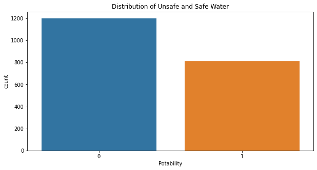
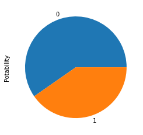
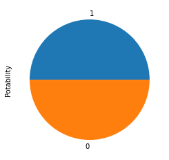
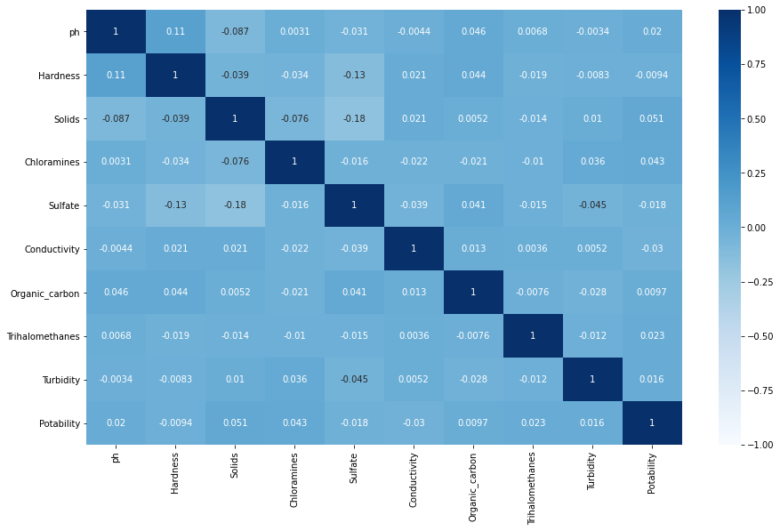
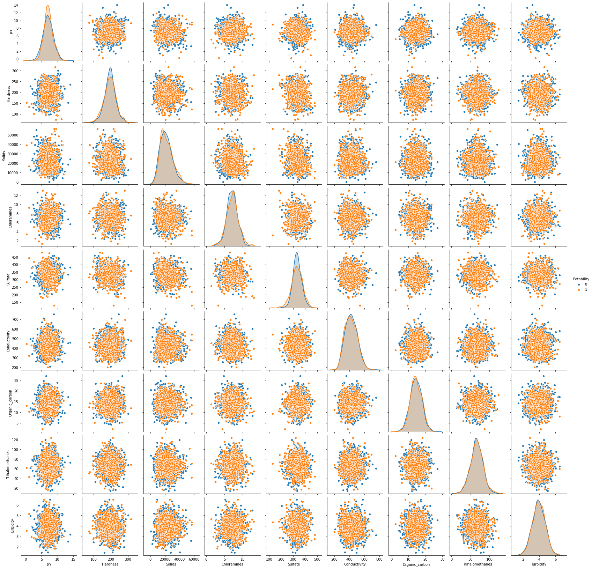

<h1>Water Quality Analysis</h1>
<p>Water Quality monitoring is definitely significant in our ecosystem. Poor quality water is more harmful to our daily life as well as aquatic  life, which could make a huge effect on the ecosystem.</p>
<p>monitoring the quality of water can help researchers predict and learn from natural processes in the environment. Also, it could determine human impacts on an ecosystem.</p>
<ul>
    <li><a href="#2" style="text-decoration: none;">Why we are working about?</a></li>
    <li><a href="#3" style="text-decoration: none;">What data we used?</a></li>
    <li>
        <ul>
            <li><a href="#4" style="text-decoration: none;">Load Python libray and Data</a></li>
            <li><a href="#5" style="text-decoration: none;">Preprocess and Anlysis</a></li>
            <li><a href="#6" style="text-decoration: none;">Prediction</a></li>
            <li><a href="#7" style="text-decoration: none;">Visualization</a></li>
        </ul>
    </li>
</ul>

<h3 id='2'>Why we are predicting?</h3>
<p>Since water is more and more essential thing for the animal kingdom, we need to take it more seriously to make it safe for animal life. Analysing water quality, humans could take steps to save the ecosystem. They can predict what should humans do. How to recover it and how to prepare for the next step. We know that global warming has become stressful for the world. Poor quality of water is one the reason.</p>

<h3 id='3'>What data is avaiable</h3>
<p>To analys the water quality, we have used <a href="https://www.kaggle.com/adityakadiwal/water-potability">Kaggle Dataset</a>. Usign the dataset I will work on multiple collams. To understand all of the coulms you can go through the Kaggle <a href="https://www.kaggle.com/adityakadiwal/water-potability">Link</a>. For conveniant, I have used the same cntent for columns.</p>

<p><b>The water_potability.csv file contains water quality metrics for 3276 different water bodies.</b></p>

<h6>1. pH value:</h6>
<p>PH is an important parameter in evaluating the acid–base balance of water. It is also the indicator of acidic or alkaline condition of water status. WHO has recommended maximum permissible limit of pH from 6.5 to 8.5. The current investigation ranges were 6.52–6.83 which are in the range of WHO standards.</p>
<h6>2. Hardness:</h6>
<p>Hardness is mainly caused by calcium and magnesium salts. These salts are dissolved from geologic deposits through which water travels. The length of time water is in contact with hardness producing material helps determine how much hardness there is in raw water. Hardness was originally defined as the capacity of water to precipitate soap caused by Calcium and Magnesium.</p>
<h6>3. Solids (Total dissolved solids - TDS):</h6>
<p>Water has the ability to dissolve a wide range of inorganic and some organic minerals or salts such as potassium, calcium, sodium, bicarbonates, chlorides, magnesium, sulfates etc. These minerals produced un-wanted taste and diluted color in appearance of water. This is the important parameter for the use of water. The water with high TDS value indicates that water is highly mineralized. Desirable limit for TDS is 500 mg/l and maximum limit is 1000 mg/l which prescribed for drinking purpose.</p>
<h6>4. Chloramines:</h6>
<p>Chlorine and chloramine are the major disinfectants used in public water systems. Chloramines are most commonly formed when ammonia is added to chlorine to treat drinking water. Chlorine levels up to 4 milligrams per liter (mg/L or 4 parts per million (ppm)) are considered safe in drinking water.</p>
<h6>5. Sulfate:</h6>
<p>Sulfates are naturally occurring substances that are found in minerals, soil, and rocks. They are present in ambient air, groundwater, plants, and food. The principal commercial use of sulfate is in the chemical industry. Sulfate concentration in seawater is about 2,700 milligrams per liter (mg/L). It ranges from 3 to 30 mg/L in most freshwater supplies, although much higher concentrations (1000 mg/L) are found in some geographic locations.</p>
<h6>6. Conductivity:</h6>
<p>Pure water is not a good conductor of electric current rather’s a good insulator. Increase in ions concentration enhances the electrical conductivity of water. Generally, the amount of dissolved solids in water determines the electrical conductivity. Electrical conductivity (EC) actually measures the ionic process of a solution that enables it to transmit current. According to WHO standards, EC value should not exceeded 400 μS/cm.
</p>
<h6>7. Organic_carbon:</h6>
<p>Total Organic Carbon (TOC) in source waters comes from decaying natural organic matter (NOM) as well as synthetic sources. TOC is a measure of the total amount of carbon in organic compounds in pure water. According to US EPA < 2 mg/L as TOC in treated / drinking water, and < 4 mg/Lit in source water which is use for treatment.</p>
<h6>8. Trihalomethanes:</h6>
<p>THMs are chemicals which may be found in water treated with chlorine. The concentration of THMs in drinking water varies according to the level of organic material in the water, the amount of chlorine required to treat the water, and the temperature of the water that is being treated. THM levels up to 80 ppm is considered safe in drinking water.</p>
<h6>9. Turbidity:</h6>
<p>The turbidity of water depends on the quantity of solid matter present in the suspended state. It is a measure of light emitting properties of water and the test is used to indicate the quality of waste discharge with respect to colloidal matter. The mean turbidity value obtained for Wondo Genet Campus (0.98 NTU) is lower than the WHO recommended value of 5.00 NTU.</p>
<h6>10. Potability:<h6>
<p>Indicates if water is safe for human consumption where 1 means Potable and 0 means Not potable.</p>

<h3 id='4'>Load Python libray and Data</h3>
<p>After download the data. It time to load python libray.</p>


```python
import matplotlib.pyplot as plt
import pandas as pd
import numpy as np
import seaborn as sns
```


```python
df = pd.read_csv("data/water_potability.csv")
df.head()
```


<div>
<style scoped>
    .dataframe tbody tr th:only-of-type {
        vertical-align: middle;
    }

    .dataframe tbody tr th {
        vertical-align: top;
    }

    .dataframe thead th {
        text-align: right;
    }
</style>
<table border="1" class="dataframe">
  <thead>
    <tr style="text-align: right;">
      <th></th>
      <th>ph</th>
      <th>Hardness</th>
      <th>Solids</th>
      <th>Chloramines</th>
      <th>Sulfate</th>
      <th>Conductivity</th>
      <th>Organic_carbon</th>
      <th>Trihalomethanes</th>
      <th>Turbidity</th>
      <th>Potability</th>
    </tr>
  </thead>
  <tbody>
    <tr>
      <th>0</th>
      <td>NaN</td>
      <td>204.890455</td>
      <td>20791.318981</td>
      <td>7.300212</td>
      <td>368.516441</td>
      <td>564.308654</td>
      <td>10.379783</td>
      <td>86.990970</td>
      <td>2.963135</td>
      <td>0</td>
    </tr>
    <tr>
      <th>1</th>
      <td>3.716080</td>
      <td>129.422921</td>
      <td>18630.057858</td>
      <td>6.635246</td>
      <td>NaN</td>
      <td>592.885359</td>
      <td>15.180013</td>
      <td>56.329076</td>
      <td>4.500656</td>
      <td>0</td>
    </tr>
    <tr>
      <th>2</th>
      <td>8.099124</td>
      <td>224.236259</td>
      <td>19909.541732</td>
      <td>9.275884</td>
      <td>NaN</td>
      <td>418.606213</td>
      <td>16.868637</td>
      <td>66.420093</td>
      <td>3.055934</td>
      <td>0</td>
    </tr>
    <tr>
      <th>3</th>
      <td>8.316766</td>
      <td>214.373394</td>
      <td>22018.417441</td>
      <td>8.059332</td>
      <td>356.886136</td>
      <td>363.266516</td>
      <td>18.436524</td>
      <td>100.341674</td>
      <td>4.628771</td>
      <td>0</td>
    </tr>
    <tr>
      <th>4</th>
      <td>9.092223</td>
      <td>181.101509</td>
      <td>17978.986339</td>
      <td>6.546600</td>
      <td>310.135738</td>
      <td>398.410813</td>
      <td>11.558279</td>
      <td>31.997993</td>
      <td>4.075075</td>
      <td>0</td>
    </tr>
  </tbody>
</table>
</div>


<h3 id='5'>Preprocessing</h3>


```python
df.columns
```


    Index(['ph', 'Hardness', 'Solids', 'Chloramines', 'Sulfate', 'Conductivity',
           'Organic_carbon', 'Trihalomethanes', 'Turbidity', 'Potability'],
          dtype='object')


```python
df.shape
```


    (3276, 10)


```python
df.info()
```

    <class 'pandas.core.frame.DataFrame'>
    RangeIndex: 3276 entries, 0 to 3275
    Data columns (total 10 columns):
     #   Column           Non-Null Count  Dtype  
    ---  ------           --------------  -----  
     0   ph               2785 non-null   float64
     1   Hardness         3276 non-null   float64
     2   Solids           3276 non-null   float64
     3   Chloramines      3276 non-null   float64
     4   Sulfate          2495 non-null   float64
     5   Conductivity     3276 non-null   float64
     6   Organic_carbon   3276 non-null   float64
     7   Trihalomethanes  3114 non-null   float64
     8   Turbidity        3276 non-null   float64
     9   Potability       3276 non-null   int64  
    dtypes: float64(9), int64(1)
    memory usage: 256.1 KB
    


```python
df.isnull().sum() #To cehck out the null
```


    ph                 491
    Hardness             0
    Solids               0
    Chloramines          0
    Sulfate            781
    Conductivity         0
    Organic_carbon       0
    Trihalomethanes    162
    Turbidity            0
    Potability           0
    dtype: int64


```python
df = df.dropna()
df.isnull().sum()
```


    ph                 0
    Hardness           0
    Solids             0
    Chloramines        0
    Sulfate            0
    Conductivity       0
    Organic_carbon     0
    Trihalomethanes    0
    Turbidity          0
    Potability         0
    dtype: int64


```python
df.shape
```


    (2011, 10)


```python
plt.figure(figsize=(10,5))
sns.countplot(df.Potability)
plt.title('Distribution of Unsafe and Safe Water') # 0 for safe and 1 unsafe
plt.show()
```





```python
df.Potability.value_counts().plot(kind ='pie')
```


    <AxesSubplot:ylabel='Potability'>





```python
df.Potability.value_counts()
```


    0    1200
    1     811
    Name: Potability, dtype: int64


<p>The sample is unbalance. the safe water is greater than unsafe. Since the number of sample of 0 is 1200 and 811 for 1, we need to upsample to balance it and to avoid the bias </p>


```python
from sklearn.utils import resample
zero = df[df['Potability'] == 0]
one = df[df['Potability'] == 1]
one_upsample = resample(one, replace = True, n_samples=1200)
df = pd.concat([zero, one_upsample])
from sklearn.utils import shuffle
df = shuffle(df)
df.shape
```


    (2400, 10)


```python
df.Potability.value_counts().plot(kind='pie')
```


    <AxesSubplot:ylabel='Potability'>





```python
plt.figure(figsize=(15,9))
sns.heatmap(df.corr(), vmin=-1, vmax=1, annot = True, cmap="Blues")
plt.show()
```





<p><b>As we know the correlation range between -1 and 1. A perfect correlation by negative 1 or positive 1. 0 mean no correlation between the variable.</b></p>


```python
df.columns
```


    Index(['ph', 'Hardness', 'Solids', 'Chloramines', 'Sulfate', 'Conductivity',
           'Organic_carbon', 'Trihalomethanes', 'Turbidity', 'Potability'],
          dtype='object')


```python
sns.pairplot(df, hue='Potability', height=2.5);
plt.show()
```





```python
df.corr()['Potability'].sort_values(ascending = False)
```


    Potability         1.000000
    Solids             0.050750
    Chloramines        0.043087
    Trihalomethanes    0.022599
    ph                 0.019530
    Turbidity          0.016021
    Organic_carbon     0.009710
    Hardness          -0.009373
    Sulfate           -0.018467
    Conductivity      -0.030132
    Name: Potability, dtype: float64


<p><b>As I can see there less correlation between all factors</b></p>


```python
X = df.drop(['Potability'], axis = 1)
y = df['Potability']
```


```python
from sklearn.preprocessing import StandardScaler
stds = StandardScaler()
X[X.columns] = stds.fit_transform(X[X.columns])
df = pd.concat([X, y], axis=1)
```


```python
df.head()
```


<div>
<style scoped>
    .dataframe tbody tr th:only-of-type {
        vertical-align: middle;
    }

    .dataframe tbody tr th {
        vertical-align: top;
    }

    .dataframe thead th {
        text-align: right;
    }
</style>
<table border="1" class="dataframe">
  <thead>
    <tr style="text-align: right;">
      <th></th>
      <th>ph</th>
      <th>Hardness</th>
      <th>Solids</th>
      <th>Chloramines</th>
      <th>Sulfate</th>
      <th>Conductivity</th>
      <th>Organic_carbon</th>
      <th>Trihalomethanes</th>
      <th>Turbidity</th>
      <th>Potability</th>
    </tr>
  </thead>
  <tbody>
    <tr>
      <th>708</th>
      <td>-0.845775</td>
      <td>-0.346399</td>
      <td>1.049196</td>
      <td>0.762216</td>
      <td>0.564708</td>
      <td>-0.561544</td>
      <td>-1.195847</td>
      <td>2.069693</td>
      <td>-1.128201</td>
      <td>1</td>
    </tr>
    <tr>
      <th>1583</th>
      <td>0.406285</td>
      <td>0.899450</td>
      <td>-0.296854</td>
      <td>-0.011092</td>
      <td>-1.030369</td>
      <td>0.110170</td>
      <td>0.215442</td>
      <td>0.500360</td>
      <td>-0.343870</td>
      <td>1</td>
    </tr>
    <tr>
      <th>2212</th>
      <td>2.214658</td>
      <td>2.522262</td>
      <td>0.760127</td>
      <td>-2.750185</td>
      <td>1.108914</td>
      <td>-1.133616</td>
      <td>0.173038</td>
      <td>-0.089080</td>
      <td>-1.181091</td>
      <td>0</td>
    </tr>
    <tr>
      <th>2826</th>
      <td>-0.473379</td>
      <td>0.965920</td>
      <td>-0.680427</td>
      <td>0.245160</td>
      <td>1.875426</td>
      <td>-0.867864</td>
      <td>-1.333477</td>
      <td>0.976554</td>
      <td>1.247670</td>
      <td>1</td>
    </tr>
    <tr>
      <th>1290</th>
      <td>-0.121239</td>
      <td>0.446552</td>
      <td>2.103746</td>
      <td>-0.188770</td>
      <td>-0.932920</td>
      <td>-1.052661</td>
      <td>1.141563</td>
      <td>1.070808</td>
      <td>-3.186765</td>
      <td>0</td>
    </tr>
  </tbody>
</table>
</div>


<h3 id='7'>Prediction</h3>


```python
from sklearn.model_selection import train_test_split
X_train, X_test, y_train, y_test = train_test_split(X, y, test_size=0.3, random_state=101)
print(X_train.shape)
print(X_test.shape)
```

    (1680, 9)
    (720, 9)
    


```python
from sklearn.linear_model import LogisticRegression, RidgeClassifier, SGDClassifier, PassiveAggressiveClassifier
from sklearn.svm import SVC
from sklearn.neighbors import KNeighborsClassifier
from sklearn.metrics import precision_score, confusion_matrix, plot_confusion_matrix
models = [('LR', LogisticRegression(max_iter=1000)),('Ridge', RidgeClassifier()),('SGDC', SGDClassifier()),('PassiveAggressive',PassiveAggressiveClassifier()),("SVC", SVC()), ('KNN', KNeighborsClassifier(n_neighbors=10))]
results = []
names = []
FinalResults = []
for name, model in models:
    model.fit(X_train,y_train)
    pred_y = model.predict(X_test)
    score = precision_score(y_test,pred_y)
    results.append(score)
    names.append(name)
    FinalResults.append((name, score))
```


```python
FinalResults
```


    [('LR', 0.49279538904899134),
     ('Ridge', 0.49279538904899134),
     ('SGDC', 0.5063938618925832),
     ('PassiveAggressive', 0.5218446601941747),
     ('SVC', 0.6834319526627219),
     ('KNN', 0.653968253968254)]


<h4>We got higher accuracy for SVC which is 0.68 or 68%</h4>
